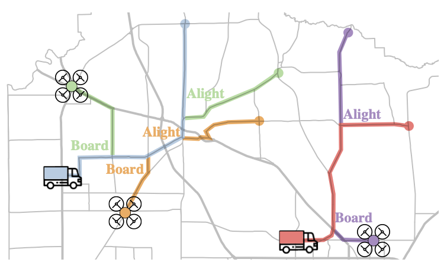

# AerialGroundPathFinding

**Disclaimer** I coded this project in fits and starts as I was wrapping up my thesis and switching gears. I only had the cycles for some basic code cleaning and threadbare commenting, and will be unable to respond to issues or comments.

This repository accompanies our AAMAS 2022 paper _Coordinated Multi-Agent Pathfinding for Drones and Trucks over Road Networks_ ([arXiv](https://arxiv.org/abs/2110.08802)). The paper presents an algorithmic framework to route a team of aerial and ground agents (drones and trucks) over large-scale road networks. We coordinate agents to save on total distance traveled, by planning for drones to use trucks as temporary modes of transit en route to their destinations.

<p float="middle">
  
   
</p>


## Setup

For those familiar with the Julia package manager, I've provided a `Manifest.toml` because of three custom dependencies: (i) my fork of [Graphs.jl](https://github.com/Shushman/Graphs.jl), which has various extensions to A* with an implicit graph representation, (ii) the now inactive [LightGraphs.jl](https://github.com/sbromberger/LightGraphs.jl), and (iii) my [MultiAgentPathFinding.jl](https://github.com/Shushman/MultiAgentPathFinding.jl), which implements Enhanced CBS. You can also just `add` all of these dependencies and this repo, instead of instantiating the environment.

The `AerialGroundPathFinding` repo is set up as a package with its own environment in [Julia](https://julialang.org/downloads/) (version 1.3 or later). Look at **Using someone else's project** at the Julia [package manager documentation](https://pkgdocs.julialang.org/v1/environments/) for the general idea. To get the code up and running (after having installed Julia), first `cd` into the `AerialGroundPathFinding` folder.
Then start the Julia REPL and go into [package manager](https://docs.julialang.org/en/v1/stdlib/Pkg/) mode by pressing `]`, followed by:
```shell
(v1.0) pkg> activate .
(AerialGroundPathFinding) pkg> instantiate
```
This will install the necessary dependencies and essentially reproduce the Julia environment required to make the package work. You can test this by exiting the package manager mode with the backspace key and then in the Julia REPL entering:
```shell
julia> using AerialGroundPathFinding
```
The full package should then pre-compile. After this step, you can run the experiment scripts in the `scripts/` folder.

## Selective Code Overview

To help understand the code structure and map it to the paper, here's a brief overview of *some* of the code in the `src/` and `scripts/` folders. Important structs and methods in the various files have additional comments.

- `src/stage1_paths.jl`: Various functions for computing Stage 1 paths; augments road network with drone-annotated weight-discounted edge copies; implements `MultiAgentPathFinding.jl` required overrides for the ground MAPF problem.
- `src/stage2_paths.jl`: Equivalent to `stage1_paths.jl` but for the aerial MAPF problem; creates road-and-transit network with Stage 1 paths; also implements `MultiAgentPathFinding.jl` required overrides.
- `src/prioritized_planning.jl`: Since prioritized planning is not implemented in `MultiAgentPathFinding.jl`, this file does it.
- `scripts/benchmark_*.jl`: All three versions of this script have a similar structure. Given the number of trucks and drones, the truck capacity, and the numbe of trials, it benchmarks the corresponding approach and stores the key results for each trial.
- `scripts/benchmark_scripts_*.sh`: Bash scripts that run several instances of a benchmark. I've only included a subset of the bash scripts that I use for the paper experiments.